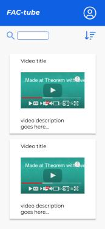
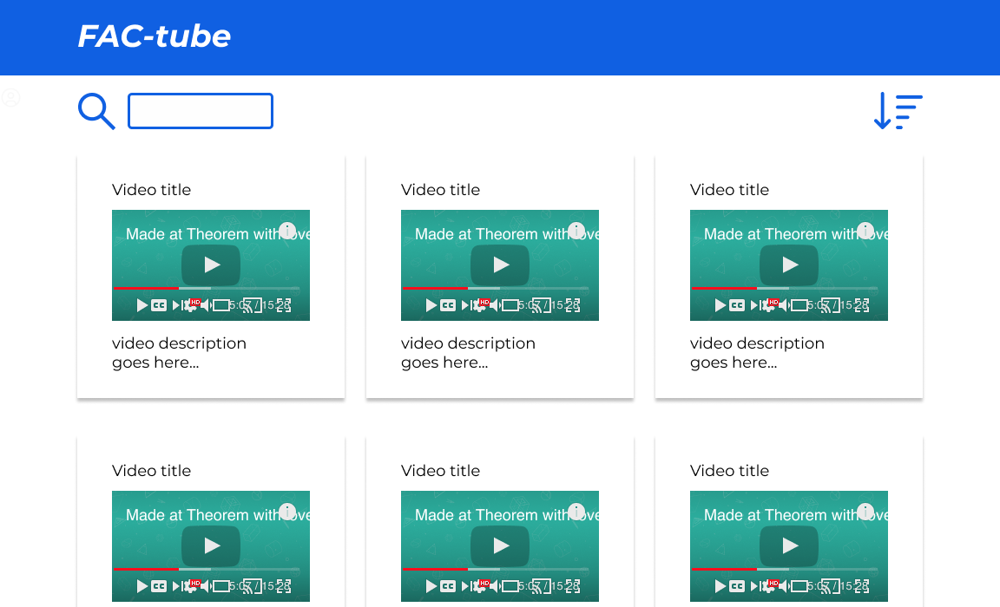
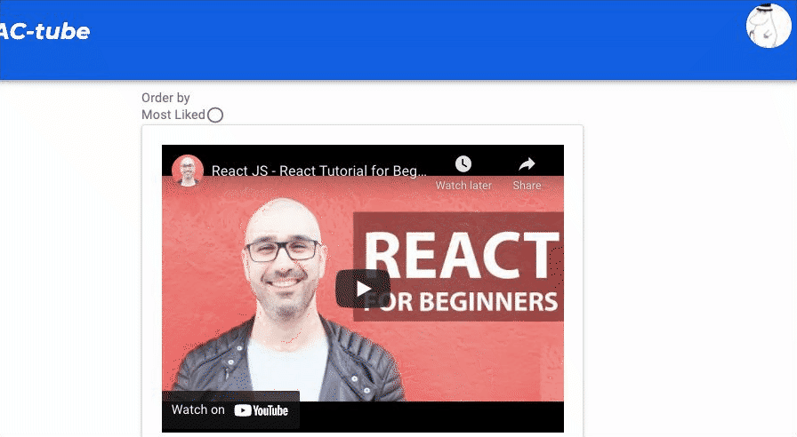
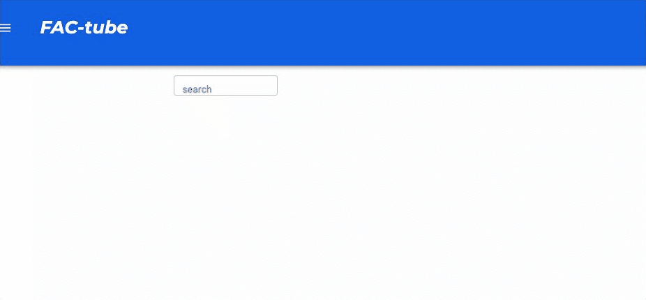
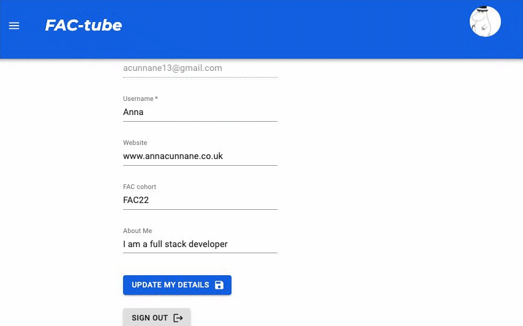
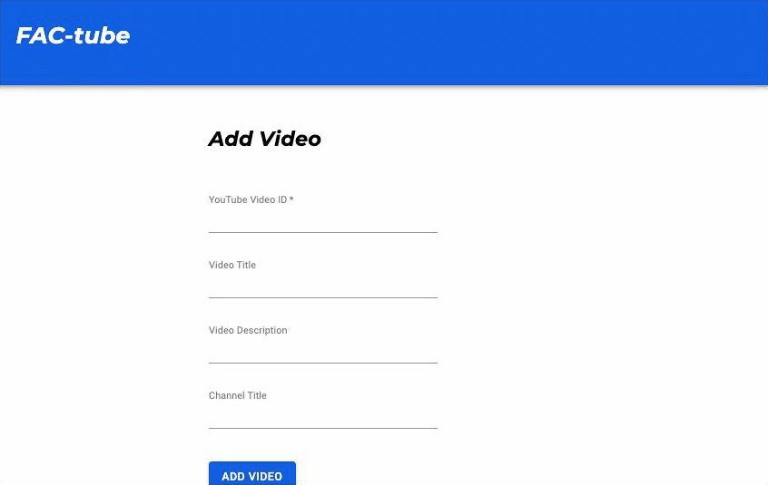
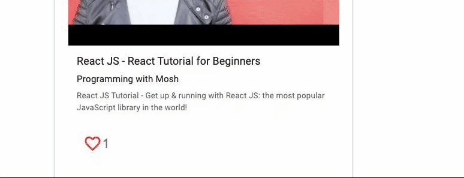
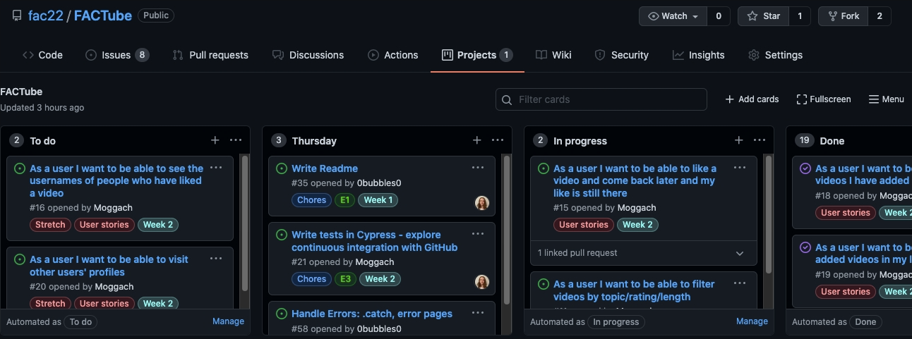

# FAC-Tube 📺

## The Product

FAC-Tube is a website where members of the FAC community
(applicants, current cohorts, alumni) can easily find and recommend useful coding YouTube videos.

## Our Team

- [Anna](https://github.com/Moggach) (QA)
- [Danilo](https://github.com/danilo-cupido) (DevOps)
- [Mohamed](https://github.com/Alisyad9)(UX)
- [Barbara](https://github.com/0bubbles0) (Scrum)

Many thanks to our project & role mentors, the FAC team and our code reviewers 🎉

## Tech Stack 🥞

- Miro & Figma for Wireframing 🎨
- Material UI for CSS components 💅
- Next.js with React.js for front-end & back-end 🚀
- Supabase for our Postgres database & Authentication 🔑
- Cypress for Testing 🌲
- Vercel for Deployment ⚡️

### To view this project

1. [`See our deployed version on Vercel here`](https://fac-tube.vercel.app/)
2. Run the code locally

Clone the repo

`cd` into the folder and run

`NPM install`

then

`NPM run dev `

## What we learnt 📚

📌 How to analyse a problem we believed our users were facing

📌 How to conduct user research to test our assumptions in that process

📌 How to create a prototype based on that research

📌 How to test our prototype with users

📌 How to make adjustments to our prototype based on user feedback and identify an MVP

📌 How to plan two build sprints to make that MVP

📌 How to set up a Supabase database and access it using Next.js functions such as `getServerSideProps()`

📌 How to query the YouTube API with a user generated search term and display the results on the page 📺

📌 How to find and install relevant packages from NPM e.g. ReactPlayer 🧩

📌 How to handle user authentification and login using Supabase

📌 How to use Material UI to write our CSS

📌 How to handle insertions and updates to our database based on user input

📌 How to render different UIs depending on whether a user has logged in and who the user is 👩🏻‍💻

### Wireframing & Prototype

Our wireframes in Figma

### Our MVP

Our MVP has based on the features our user research had identified as the most important 📝

It has a home page with a community video library that is sortable by most liked

a user can search YouTube

a user can view and update their profile

a user can add a video to their library

a user can view their added videos in their library

a user can like a video

### Future improvements 🕰

📌 A user should be able to apply tags to a video depending on topic,
video features etc

📌 A user should be able to see who has liked a video

📌 Users should be able to view each other's profiles

📌 A user should be able to add a video to their library
with just a YouTube url

📌 More resuable code/components

### Challenges

- Learning new technologies 😓

- Length of project 📅

- Understanding the scope of the project - what was possible and what not to build

### Sprint planning 🏃‍♀️

Our [Kanban](https://github.com/fac22/FACTube/projects/1) board with time estimations and labels based on issue type and priority

✅ Daily stand ups

✅ Frequent merge and code review

✅ Swapping over work on challenging areas and sharing knowedge

✅ Asking questions - of mentors and in Help and Solutions

### Build Sprint 1 🧱

- Setting up Next.js with initial Vercel deployment
- YouTube API search feature 🔎
- Like button component 💖

### Build Sprint 2 🧱🧱

- User login/sign out and authentification
- CSS with Material UI
- User can view and update their profile
- User can view their library and add a video to the library
- User can like a video which increments the likes counter and is stored against their user id

### Bugs 🐛

Lots of bugs!

Fetching from a Supabase database using async functions
was tricky to render on the page using React
Customising Materials UI was harder than expected
Our YouTube API key often maxxed out
Vercel sometimes gave us errors in deployment that were not apparent in development
